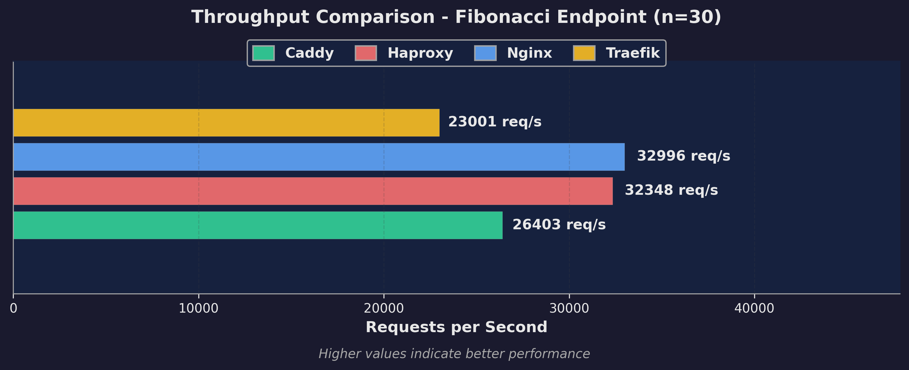
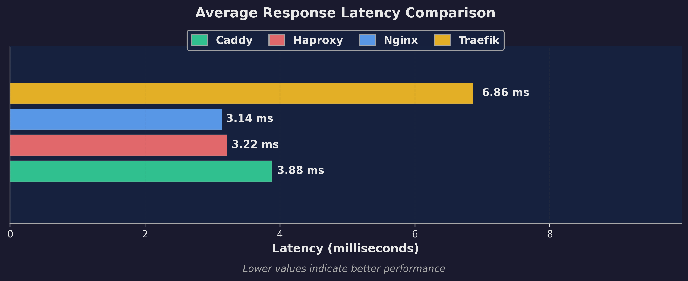
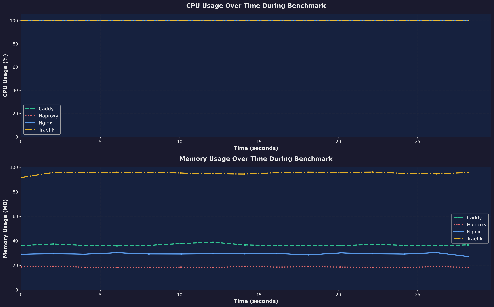

# 🚀 Reverse Proxy Benchmark: Nginx vs Caddy vs Traefik

Performance comparison of three popular reverse proxies using Docker, wrk load testing, and a Rust backend with CPU-intensive endpoints.


## 📊 Benchmark Results

### Throughput & Performance



### Latency Analysis



### Resource Usage




## Example backend used in this benchmark

The backend is built with **Axum** (Rust web framework) using **Tokio** for async runtime:
- Routes: root HTML page, `/api/health` health check, `/api/compute/fibonacci?n=30` CPU-intensive endpoint
- Fibonacci calculation runs in `spawn_blocking` to prevent blocking the async runtime
- Uses iterative algorithm (not recursive) to efficiently compute Fibonacci numbers up to n=50
- CORS enabled via `tower-http` middleware, listening on port 3000
- Fast, memory-safe, and handles concurrent requests efficiently

## 🚀 Quick Start


```bash
pip install matplotlib numpy
```

```bash
# 1. Start services (Nginx:8080, Caddy:8081, Traefik:8082)
docker compose up -d

# 2. Run benchmark
./benchmark.sh

# 3. Generate charts
python3 analyze_results.py
```

## 📦 Prerequisites

- Docker & Docker Compose
- Python 3 with: `pip3 install matplotlib numpy`
- wrk (optional - auto-uses Docker if not installed)

## 🎯 What Gets Tested

- **Endpoint**: `/api/compute/fibonacci?n=30` (CPU-intensive Fibonacci calculation)
- **Load**: 4 threads, 100 connections, 30s duration
- **Metrics**: Throughput (req/s), latency (avg, p50, p75, p90, p99), CPU %, Memory MB
- **Resource Limits**: 1 CPU, 512MB RAM per proxy

## 📈 Typical Results

- **Nginx**: Highest throughput, lowest latency (C-based, highly optimized)
- **Caddy**: Good balance, automatic HTTPS (Go-based)
- **Traefik**: Feature-rich dynamic routing (Go-based)

## 🧹 Cleanup

```bash
docker compose down
rm -rf results/ charts/
```
